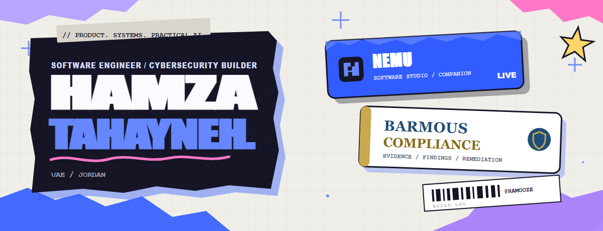
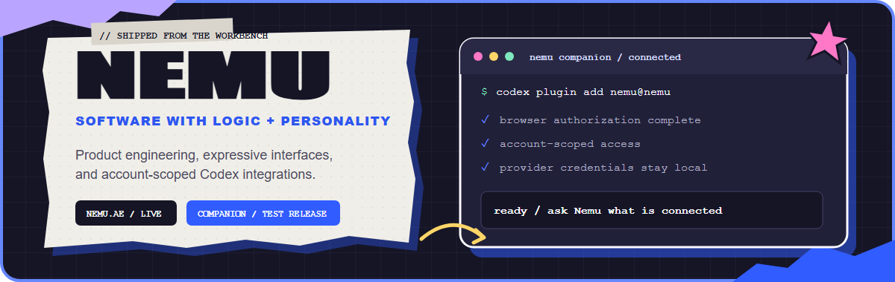
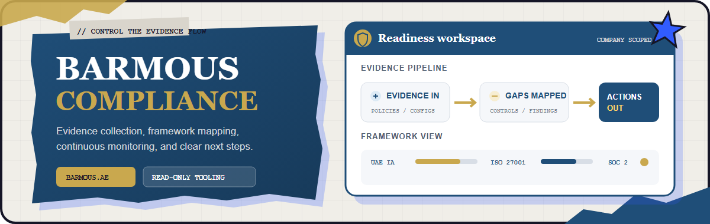

  <picture>
    <source media="(prefers-color-scheme: dark)" srcset="./assets/hero-dark.png">
    <source media="(prefers-color-scheme: light)" srcset="./assets/hero-light.png">
    
  </picture>

  <a href="https://tahayneh.com"><strong>Portfolio</strong></a>
  &nbsp;/&nbsp;
  <a href="https://www.linkedin.com/in/hamza-tahayneh-654710248"><strong>LinkedIn</strong></a>
  &nbsp;/&nbsp;
  <a href="mailto:hamzatahayneh@gmail.com"><strong>Email</strong></a>
  &nbsp;/&nbsp;
  <a href="https://github.com/Hamooze"><strong>GitHub</strong></a>

  I turn complicated workflows into useful products, secure systems, and tools people can actually run. 
  Working across product engineering, cybersecurity, and practical AI from the UAE and Jordan.

## Selected work

<picture>
  <source media="(max-width: 600px)" srcset="./assets/nemu-showcase-mobile.png">
  
</picture>

### [Nemu](https://nemu.ae)

Nemu is a software engineering studio building clear, useful, and memorable digital products. I publish the public [Nemu Companion marketplace](https://github.com/Hamooze/nemu-plugins), currently carrying the account-scoped Companion test release for Codex with explicit consent boundaries and optional fixed read-only local-provider status checks.

`software engineering` `product systems` `Codex plugins` `Node.js`

<picture>
  <source media="(max-width: 600px)" srcset="./assets/barmous-showcase-mobile.png">
  
</picture>

### [Barmous Compliance](https://barmous.ae)

Barmous is building automated compliance infrastructure for UAE organizations, covering evidence collection, framework assessment, continuous monitoring, and remediation guidance. My public work includes its evaluation preview: company-scoped, read-only [CLI and local MCP tooling](https://github.com/Barmous-Compliance/barmous-plugin-d42ecfb21abc) for evidence-gap review, findings triage, framework review, and remediation planning.

`compliance automation` `security workflows` `TypeScript` `MCP / CLI tooling`

## From the workbench

- **[Vehicular IDS + Federated Learning / LLM Lab](https://github.com/Hamooze/vehicular-ids-federated-llm)** - A Docker-first intrusion-detection testbed with tiered specialist nodes, federated coordination, live attack simulation, operator dashboards, and Ollama-assisted analysis.
- **[Lily Dulce](https://lilydulce.ae) / [Bakery Commerce System](https://github.com/Hamooze/bakery-website-shopping-system)** - A live bilingual bakery platform built with Next.js, Prisma/PostgreSQL, Stripe, protected admin and inventory workflows, WhatsApp notifications, and scheduled UAE delivery.
- **[Mesh Story](https://meshstory.ae)** - A live food-commerce experience for daily sweets and scheduled UAE delivery.
- **[tahayneh.com](https://tahayneh.com)** - My Next.js profile hub and selected-project gallery, with purposeful motion and a security-conscious deployment setup. [Source](https://github.com/Hamooze/hamza-profile).
- **Team game builds** - Collaborative work across [Heritage Gameathon](https://github.com/Goldluckss/Heritage-Gameathon) in Unity/C# and [Shift GameJam](https://github.com/Goldluckss/Shift-GameJam) in Godot/GDScript.

## What I build

- **End-to-end product systems** - Interfaces, APIs, data models, payments, deployment, and clear experiences across the whole flow.
- **Security-minded software** - Authentication boundaries, CSRF protection, rate limiting, audit trails, evidence workflows, and network-security experiments.
- **Practical AI and automation** - Federated-learning experimentation, Ollama-backed analysis, Codex plugin design, and workflow tooling.

## Working toolkit

**Product engineering** - TypeScript, JavaScript, React, Next.js, Prisma, PostgreSQL, Stripe, REST APIs  
**Security and systems** - Python, Docker, networking, intrusion detection, federated learning, compliance tooling  
**Additional languages / prior work** - Java, C#, PHP, HTML/CSS, GDScript  
**Design and delivery** - UI/visual design, prototyping, Vercel, GitHub, Codex workflows

## Background

Academic background in cybersecurity-focused computing at Khalifa University (2022-2026). Earlier work includes server-management tooling, a Java university volunteering system, a flower-shop app prototype, and game-jam builds.

Arabic and English (fluent) / French (intermediate)

## Open channel

I am open to selected collaborations around software products, cybersecurity systems, internal platforms, and practical AI tooling.

**[Start with the work](https://tahayneh.com/projects)** / **[Connect on LinkedIn](https://www.linkedin.com/in/hamza-tahayneh-654710248)** / **[Email me](mailto:hamzatahayneh@gmail.com)**

  <code>// useful software. secure systems. clear delivery.</code>

