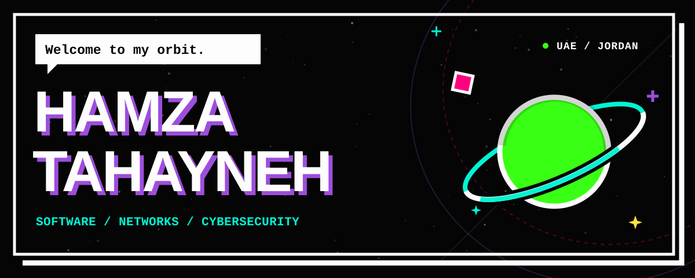
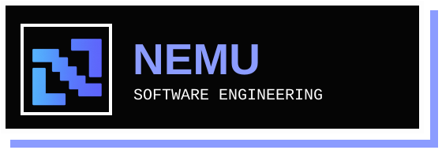
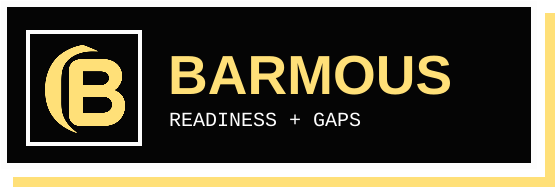
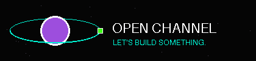

  <a href="https://tahayneh.com/">
    <picture>
      <source media="(max-width: 600px)" srcset="./assets/orbit-hero-mobile.svg">
      
    </picture>
  </a>

  <a href="#projects"><strong>PROJECTS</strong></a>
  &nbsp; / &nbsp;
  <a href="#toolkit"><strong>TOOLKIT</strong></a>
  &nbsp; / &nbsp;
  <a href="#open-channel"><strong>OPEN CHANNEL</strong></a>

  I build useful products, secure systems, and tools people can actually run. 
  Software engineering, network cybersecurity, and practical AI — from the UAE and Jordan.

  
  &nbsp;
  

## Projects

  
  &nbsp;
  

<strong>Nemu / open the project dossier</strong>

### Useful software, built end to end

Nemu is a software engineering studio building digital products and the systems behind them. My work spans interfaces, APIs, data models, integrations, and delivery.

The public **Nemu Companion** marketplace contains tooling for Codex, with account-scoped access and explicit consent boundaries.

`TypeScript` `Node.js` `product engineering` `Codex plugins`

**[Explore the Companion source](https://github.com/Hamooze/nemu-plugins)** · **[Nemu](https://nemu.ae)**

<strong>Barmous / open the project dossier</strong>

### Evidence into readiness decisions

Barmous is a compliance readiness and gap-assessment platform for UAE organizations. The work connects evidence, framework assessments, findings, and remediation planning.

My public work includes the evaluation preview of its company-scoped, read-only **CLI and local MCP tooling** for evidence-gap review, findings triage, and framework review.

`TypeScript` `security workflows` `MCP` `CLI tooling`

**[Explore the tooling source](https://github.com/Barmous-Compliance/barmous-plugin-d42ecfb21abc)** · **[Barmous](https://barmous.ae)**

<strong>More from the workbench / explore projects and experiments</strong>

| Project | What I worked on |
| --- | --- |
| [Vehicular IDS + federated learning / LLM lab](https://github.com/Hamooze/vehicular-ids-federated-llm) | An intrusion-detection testbed with specialist nodes, federated coordination, attack simulations, operator dashboards, and Ollama-assisted analysis. |
| [Bakery commerce system](https://github.com/Hamooze/bakery-website-shopping-system) / [Lily Dulce](https://lilydulce.ae) | A bilingual commerce platform with Next.js, Prisma/PostgreSQL, Stripe, admin workflows, and scheduled delivery. |
| [Mesh Story](https://meshstory.ae) | A food-commerce experience for daily sweets and scheduled UAE delivery. |
| [tahayneh.com](https://tahayneh.com/) · [Source](https://github.com/Hamooze/hamza-profile) | This space-themed personal hub: Next.js, neon brand marks, and orbital motion. |
| [Heritage Gameathon](https://github.com/Goldluckss/Heritage-Gameathon) / [Shift GameJam](https://github.com/Goldluckss/Shift-GameJam) | Collaborative Unity/C# and Godot/GDScript game builds. |

## Toolkit

<strong>Product engineering / inspect the stack</strong>

**TypeScript · JavaScript · React · Next.js · Node.js** 
Prisma, PostgreSQL, REST APIs, payments with Stripe, interface design, and deployment.

<strong>Security and systems / inspect the stack</strong>

**Python · Docker · Networking · Intrusion detection** 
Authentication boundaries, rate limiting, audit trails, evidence workflows, and federated-learning experiments.

<strong>AI and automation / inspect the stack</strong>

**Ollama · Codex · MCP · CLI tooling** 
Local analysis tools, consent-aware integrations, workflow automation, and practical AI in product systems.

<strong>Background / a little more about me</strong>

Academic background in cybersecurity-focused computing at **Khalifa University (2022–2026)**. Earlier projects include server-management tooling, a Java university volunteering system, a flower-shop app prototype, and game-jam builds.

Additional languages and prior work: **Java · C# · PHP · HTML/CSS · GDScript**.

**Arabic and English:** fluent · **French:** intermediate.

## Open channel

Open to selected collaborations around software products, cybersecurity systems, internal platforms, and practical AI tooling.

  <picture>
    <source media="(prefers-reduced-motion: reduce)" srcset="./assets/orbit-signal.png">
    
  </picture>

  <a href="mailto:hamza.tahayneh@nemu.ae"><strong>hamza.tahayneh@nemu.ae</strong></a>  
  <a href="https://www.linkedin.com/in/hamza-tahayneh-654710248">LinkedIn</a>
  &nbsp; / &nbsp;
  <a href="https://wa.me/971529787138">WhatsApp</a>
  &nbsp; / &nbsp;
  <a href="https://www.instagram.com/hamza.tahayneh">Instagram</a>
  &nbsp; / &nbsp;
  <a href="https://tahayneh.com/">Portfolio</a>

  <a href="#"><code>↑ RETURN TO ORBIT</code></a> 
  <code>TRANSMISSION ENDED. // @HAMOOZE</code>

